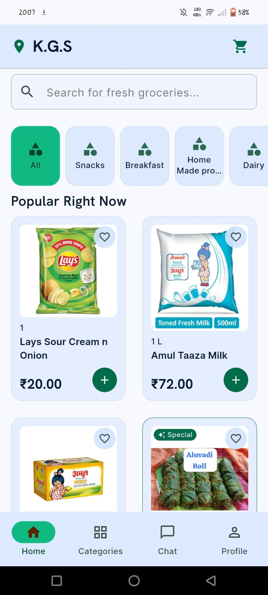
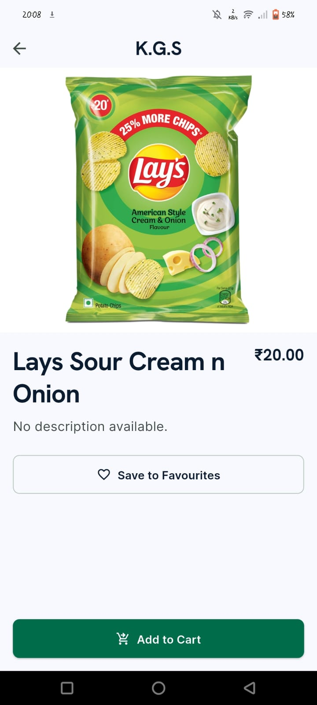
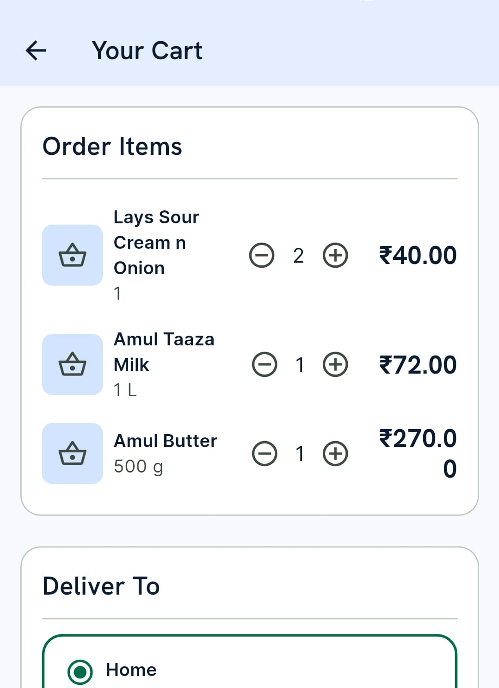
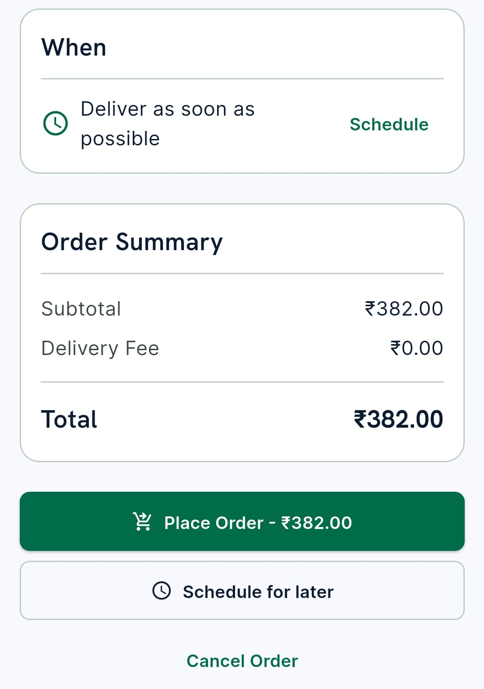
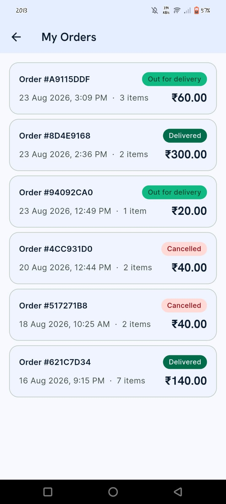
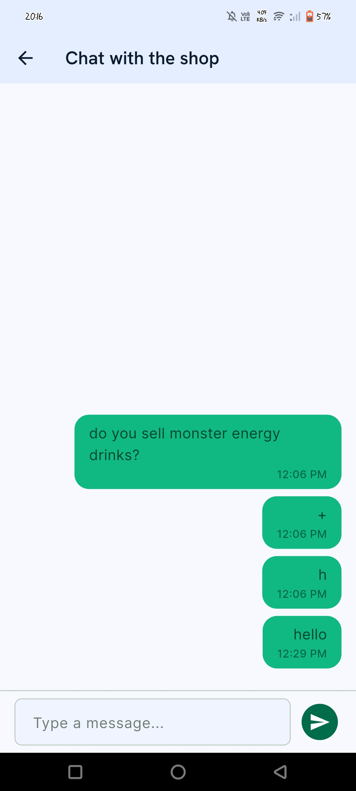
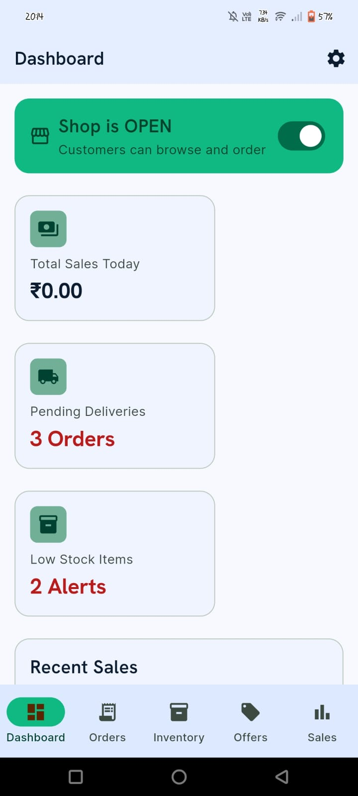
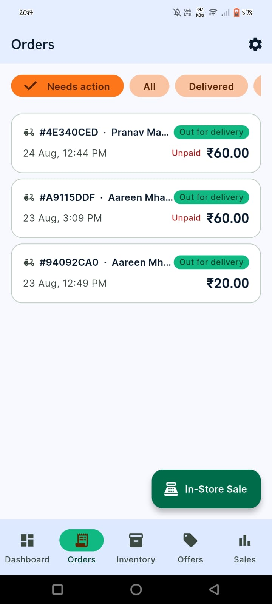
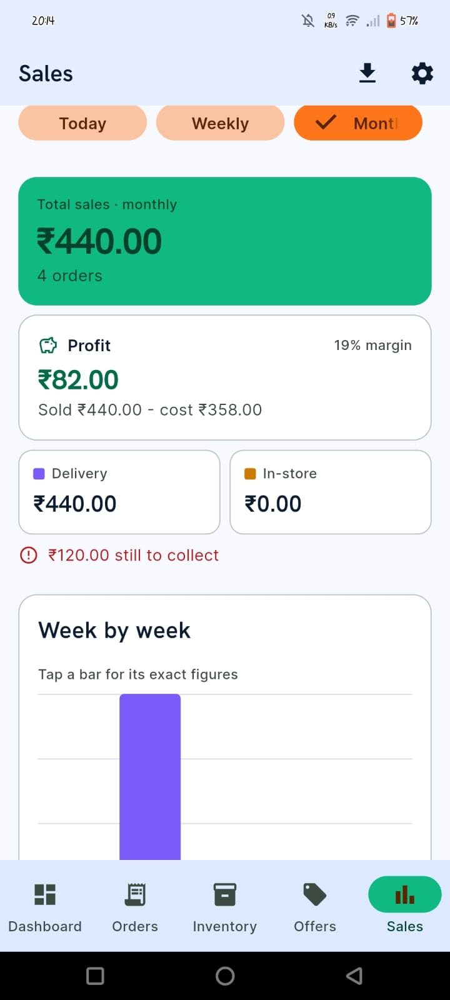
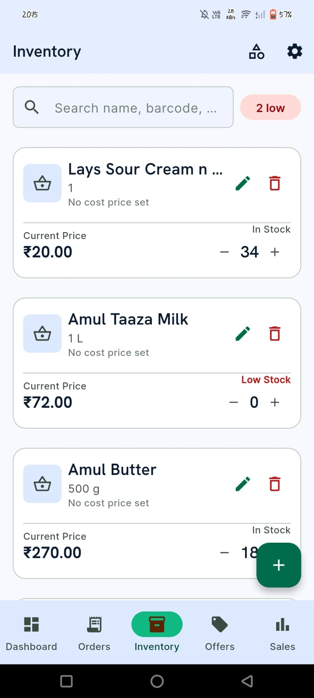

# General Stores App

A grocery delivery platform built for one real neighbourhood shop — two Android apps over a shared
PostgreSQL backend, where **every authorization rule lives in the database rather than the client**.

Customers browse and order. Staff run inventory, pricing and fulfilment. Delivery partners see only
the drops assigned to them. All three are served by one Supabase project with 64 row-level security
policies deciding who may read what.

**Stack** — Flutter (Dart) · Supabase · PostgreSQL · PL/pgSQL · PostGIS · Deno · OpenStreetMap

---

## Screenshots

**Customer app**

| Shop | Product | Cart |
|:---:|:---:|:---:|
|  |  |  |

| Checkout | Order history | Chat with the shop |
|:---:|:---:|:---:|
|  |  |  |

**Staff app**

| Dashboard | Fulfilment queue |
|:---:|:---:|
|  |  |

| Sales & profit | Inventory |
|:---:|:---:|
|  |  |

---

## Customer app

**Browsing and search**
- Product catalogue with categories, swipeable between Shop and Categories
- **Typo-tolerant search** — "amool", "mlik" and "bttr" all find the right product, ranked by
  relevance. Implemented in Postgres with trigram similarity and Levenshtein distance, not by an
  external search service
- Offers applied automatically, with the discounted price shown wherever the product appears
- Favourites — a private list each customer curates for themselves

**Ordering**
- Cart that **survives closing the app**, restoring at today's prices rather than the price when the
  item was added, and silently dropping anything since withdrawn from sale
- Cash on delivery
- **Scheduled orders** — pick a slot, and the shop confirms or declines whether it is workable
- When the shop is closed, ordering for *now* is refused (in the database, not just by hiding the
  button) while scheduling stays open
- A scrolling banner above the search bar whenever the shop is shut

**Addresses**
- Zomato-style capture: drop a pin on a map, then name the place and add door/landmark details
- Delivery fee calculated from real road distance between the shop and the pin

**After ordering**
- Three-phase progress: confirmed → out for delivery → delivered
- **Live map tracking** of the delivery partner once the order is on its way
- A popup the moment the shop accepts or declines the order, wherever you are in the app
- Chat with the shop, per-product or general

**Also**
- Light and dark themes
- Email + password auth with confirmation, and one account per mobile number

## Staff & owner app

**Fulfilment**
- Orders queue filtered by status, updating live as orders arrive
- Order detail with everything needed to pack it, plus **assigning a delivery partner**
- Counter sales — ring up a walk-in customer, which draws down the same stock
- Correct a sale that was rung up wrong, with stock adjusted to match

**Inventory & pricing**
- Products with photos, stock levels, MRP and selling price
- Categories with images
- Offers — percentage or flat, with start and end dates
- **Printable shelf tags**, laid out on screen and printed with the device's own print function
- **Write-offs** for expired or damaged stock, recording whether the supplier refunded it or the
  shop absorbed the loss

**Money**
- Sales and profit by period, split between delivery and counter
- **Cost price is snapshotted at the moment of sale**, so changing a price today never rewrites last
  month's profit
- CSV export of the sales report to the Android share sheet

**Running the shop**
- Open/closed switch that immediately gates customer ordering
- Store location and delivery-fee bands by distance
- **Staff, delivery partner and co-owner invites** — the owner issues a code, the person signs up
  with it, and a database trigger promotes their account. No password ever passes through the owner
- Customer questions inbox, with unanswered ones marked and a banner when a new one arrives

## Delivery partner

A separate, narrower experience inside the same app:

- **Only the orders assigned to them** — everything else is invisible, enforced by row-level
  security rather than by hiding it in the UI
- Customer name, phone and full address for each drop, with call and in-app map
- Picked up → delivered, plus recording cash received at the door
- GPS shared **only while a drop is in hand**, stopping by itself once the last one is delivered

---

## Under the hood

**Authorization is the database's job.** All 19 tables have row-level security; 64 policies decide
what each of the four roles may read and write. The apps hold no privileged key — the anon key they
ship with grants nothing beyond what those policies allow. A delivery partner queries the orders
table and gets back only their own assignments; cost prices return zero rows for anyone but staff
and the owner.

**Business rules are triggers, not app code.** 41 PL/pgSQL functions and 25 triggers handle stock
restoration on cancellation, delivery-fee computation from PostGIS distance, cost snapshotting at
point of sale, and restricting what a delivery partner may change on an order.

**Live updates** over Postgres logical replication — orders, chat and partner positions push to both
apps rather than being polled.

**Routing** runs through a Deno edge function so the third-party API key never ships inside an APK.

**Scheduled work** uses `pg_cron`: scheduled orders are released at their appointed time by the
database itself, whether or not any app is open.

**Maps** are OpenStreetMap via `flutter_map` — no API key, no billing account.

## Repository layout

```
apps/customer_app     Flutter app for customers
apps/staff_app        Flutter app for staff, owner and delivery partners
packages/shared       Models, repositories, theme and widgets used by both
supabase/migrations   47 versioned SQL migrations
supabase/functions    Deno edge functions
```

Design notes live in [`Decisions.md`](Decisions.md) — every significant choice, why it was made, and
what broke when it was made differently. [`Architecture.md`](Architecture.md) is the system map and
[`Flow.md`](Flow.md) traces what happens end to end when someone places an order.

## Running it

```bash
cd apps/customer_app && flutter pub get
cd ../staff_app && flutter pub get
```

Point it at your own Supabase project:

```bash
supabase link --project-ref <your-project-ref>
supabase db push          # applies all migrations
supabase functions deploy route
supabase secrets set ORS_API_KEY=<openrouteservice key>
```

Then update `packages/shared/lib/src/supabase/supabase_config.dart` with your project URL and anon
key, and build:

```bash
flutter build apk --release --split-per-abi
```

## Status

In testing with the shop it was built for. Known gaps, kept honest:

- Push notifications are not built — in-app alerts work over Realtime while an app is open, but
  reaching a closed app needs FCM
- Delivery GPS runs while the app is open; background tracking needs an Android foreground service
- The built-in Supabase email service is rate limited, so a real launch needs custom SMTP
